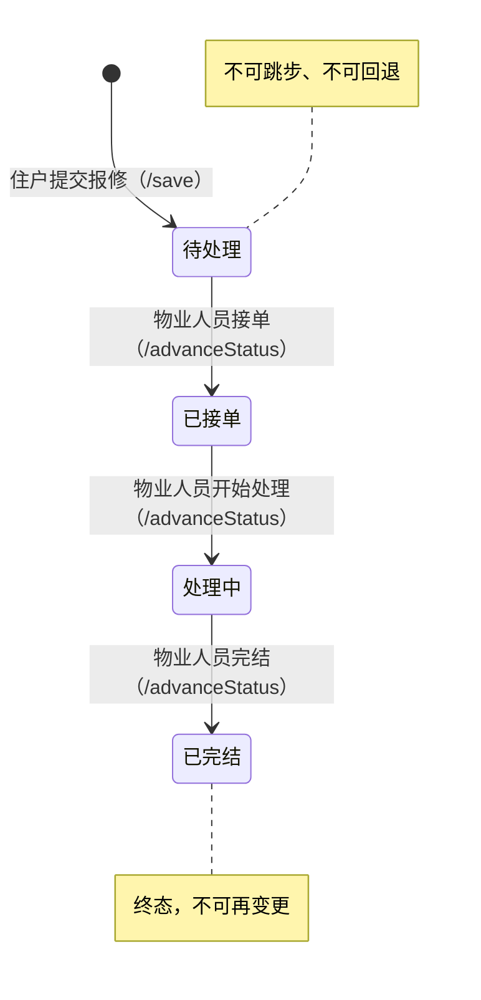

# 报修工单角色权限矩阵

> 适用范围：物业培训 / 二线技术支持 / 业主方运维手册
> 基于代码版本：`BaoxiuController.java`、`BaoxiuServiceImpl.java`、`BaoxiuService.java`

---

## 1. 系统角色定义

| 角色标识 | 中文名称 | 登录表 | 说明 |
|----------|----------|--------|------|
| `"用户"` | 住户/业主 | `yonghu` | 小区的住户，可提交报修工单 |
| `"物业人员"` | 物业/安保人员 | `wuye` | 物业管理人员，负责处理报修工单 |
| `"管理员"` | 系统管理员 | `users` | 后台超级管理员 |

角色在登录时写入 Session（`request.getSession().setAttribute("role", ...)`），后续所有接口通过读取 Session 中的 `role` 字符串进行权限判断。

---

## 2. 报修工单状态码（`baoxiu_zhuangtai_types`）

| 值 | 含义 | 常量名 | 说明 |
|----|------|--------|------|
| `1` | 待处理 | `STATUS_PENDING` | 住户提交后的初始状态 |
| `2` | 已接单 | `STATUS_ACCEPTED` | 物业人员确认接单 |
| `3` | 处理中 | `STATUS_PROCESSING` | 物业人员正在处理 |
| `4` | 已完结 | `STATUS_COMPLETED` | 工单处理完成，终态 |

### 状态机

**`/advanceStatus` 接口的校验规则**（`BaoxiuServiceImpl.advanceStatus()`）：
1. 状态只能逐步推进，**不可跳步**（1→4 不允许）
2. **不可回退**（3→2 不允许）
3. 已完结的工单**不可再推进**（4→任何 不允许）
4. **只有"物业人员"角色**才能推进状态

---

## 3. 权限矩阵总表

### 3.1 增删改查权限

| 操作 | 接口 | 用户（住户） | 物业人员 | 管理员 |
|------|------|:------------:|:--------:|:------:|
| **提交**报修 | `POST /baoxiu/save` | 可以（`yonghuId` 强制为本人） | 可以（不限制 `yonghuId`） | 可以（不限制 `yonghuId`） |
| **列表**查询（后台） | `GET /baoxiu/page` | 仅看**自己的**工单 | 看**全部**工单 | 看**全部**工单 |
| **详情**查看 | `GET /baoxiu/info/{id}` | 可看**任意**工单 | 可看**任意**工单 | 可看**任意**工单 |
| **修改**工单 | `POST /baoxiu/update` | 可改**任意**工单 | 可改**任意**工单 | 可改**任意**工单 |
| **删除**工单 | `POST /baoxiu/delete` | 可删**任意**工单 | 可删**任意**工单 | 可删**任意**工单 |
| **推进状态** | `POST /baoxiu/advanceStatus` | **被拒绝** | 可以（按状态机规则） | **被拒绝** |
| **前端列表** | `GET /baoxiu/list` | 无需登录（`@IgnoreAuth`） | 无需登录 | 无需登录 |

### 3.2 状态推进权限（`/advanceStatus` 专属接口）

| 状态变更 | 允许的角色 | 用户 | 物业人员 | 管理员 |
|----------|-----------|:----:|:--------:|:------:|
| 待处理 → 已接单 | 物业人员 | **禁止** | 允许 | **禁止** |
| 已接单 → 处理中 | 物业人员 | **禁止** | 允许 | **禁止** |
| 处理中 → 已完结 | 物业人员 | **禁止** | 允许 | **禁止** |
| 任意非法跳步 | 无 | 禁止 | 禁止 | 禁止 |

---

## 4. 各角色详细说明

### 4.1 用户（住户）

**能做的事：**
- 提交报修工单（`/save`），`yonghuId` 会被服务端强制设为当前登录用户的 ID，不可代替他人提交
- 查看**自己的**报修工单列表（`/page`，服务端强制按 `yonghuId` 过滤）
- 查看任意工单详情（`/info/{id}`，无归属校验）

**不能做的事：**
- 推进工单状态（`/advanceStatus` 会返回 `EIException："当前角色[用户]无权执行此操作"`）
- 在列表中看到其他住户的工单（`/page` 接口已做数据隔离）

### 4.2 物业人员

**能做的事：**
- 查看**全部**报修工单（`/page`，不过滤 `yonghuId`）
- 推进工单状态（`/advanceStatus`，按状态机逐步推进）
- 提交报修工单（`/save`，`yonghuId` 不受限制，可代替住户提交）

**不能做的事：**
- 通过 `/advanceStatus` 跳步或回退状态（状态机校验）

### 4.3 管理员

**能做的事：**
- 查看**全部**报修工单（`/page`，无过滤）
- 直接通过 `/update` 接口修改工单任意字段（含状态码）

**不能做的事：**
- 通过 `/advanceStatus` 推进状态（角色不在 `ALLOWED_ROLES` 白名单中）

---

## 5. 提交报修时的状态初始化

| 接口 | 行为 |
|------|------|
| `POST /baoxiu/save`（后台） | 服务端**强制**设为 `STATUS_PENDING`（1），客户端传什么状态值都无效 |
| `POST /baoxiu/add`（前端） | 服务端**不强制**状态值，依赖前端 JS 硬编码 `baoxiuZhuangtaiTypes = 2` |

> 两个接口对状态的初始化行为不一致，详见 §6 已知缺口。

---

## 6. 已知缺口（代码中未实现的安全控制）

> 以下内容是当前代码中**存在的安全隐患或逻辑缺陷**，**不是已实现功能**，需要后续版本修复。

### 缺口 1：`/update` 接口无角色权限校验

| 项目 | 说明 |
|------|------|
| **位置** | `BaoxiuController.update()`（第 171-187 行） |
| **现象** | 角色校验代码被**注释掉了**（第 177-180 行的 `if("用户".equals(role))` 被 `//` 注释） |
| **后果** | 任意已登录用户可以通过 `/update` 接口修改**任意工单**的**任意字段**，包括 `baoxiuZhuangtaiTypes`（状态码）。这意味着用户或管理员可以绕过 `/advanceStatus` 的状态机和角色校验，直接将状态改为任何值 |
| **与 `/advanceStatus` 的关系** | `/advanceStatus` 有严格的状态机 + 角色校验，但 `/update` 是一个**旁路**。物业培训时应告知：状态变更的"正规渠道"是 `/advanceStatus`，`/update` 的漏洞属于待修复项 |

### 缺口 2：`/delete` 接口无角色权限校验

| 项目 | 说明 |
|------|------|
| **位置** | `BaoxiuController.delete()`（第 194-201 行） |
| **现象** | 没有任何角色判断，任意已登录用户均可调用 |
| **后果** | 住户可以删除其他人的报修工单 |
| **建议** | 应限制为管理员或工单创建者本人才能删除 |

### 缺口 3：`/info/{id}` 和 `/detail/{id}` 无归属校验

| 项目 | 说明 |
|------|------|
| **位置** | `BaoxiuController.info()`（第 110-132 行）和 `detail()`（第 303-326 行） |
| **现象** | 虽然 `/page` 列表对"用户"做了数据隔离（只看自己的），但通过 `/info/{id}` 可以直接查看任意工单 |
| **后果** | 如果用户猜到或获取到其他工单的 ID，可以查看详情 |

### 缺口 4：`/add`（前端保存）不强制初始状态

| 项目 | 说明 |
|------|------|
| **位置** | `BaoxiuController.add()`（第 332-353 行） |
| **现象** | 不像 `/save` 那样强制 `baoxiuZhuangtaiTypes = STATUS_PENDING`，依赖前端传入 |
| **后果** | 前端 JS 硬编码为 `2`（已接单），与后台 `/save` 的 `1`（待处理）不一致 |

### 缺口 5：前端权限控制仅为 UI 级别

| 项目 | 说明 |
|------|------|
| **位置** | `admin/admin/src/views/modules/baoxiu/list.vue`、`menu.js` |
| **现象** | 前端 `isAuth()` 函数根据 `menu.js` 配置控制按钮显隐。配置中"安保人员"（对应 `wuye` 表）对报修无"删除"按钮 |
| **后果** | 前端隐藏了按钮，但后端 `/delete` 接口**没有**做角色校验。如果直接构造请求调用，仍然可以删除 |

---

## 7. 权限设计意图 vs 实际实现对照

| 设计意图 | 是否已实现 | 当前状态 |
|----------|:----------:|----------|
| 用户只能看自己的工单列表 | **已实现** | `/page` 接口按 `yonghuId` 过滤 |
| 用户只能提交自己的工单 | **部分实现** | `/save` 强制 `yonghuId`，但 `/add` 不强制 |
| 只有物业人员能推进状态 | **已实现** | `/advanceStatus` 有角色白名单 |
| 状态只能逐步推进不可跳步 | **已实现** | `/advanceStatus` 有状态机校验 |
| 用户不能修改他人工单 | **未实现** | `/update` 的角色校验被注释掉 |
| 用户不能删除他人工单 | **未实现** | `/delete` 无角色校验 |
| 管理员不能直接推进状态 | **已实现** | `ALLOWED_ROLES` 不包含"管理员" |

---

## 8. 代码引用索引

| 文件 | 路径 |
|------|------|
| Controller | `src/main/java/com/controller/BaoxiuController.java` |
| Service 接口 | `src/main/java/com/service/BaoxiuService.java` |
| Service 实现 | `src/main/java/com/service/impl/BaoxiuServiceImpl.java` |
| Entity | `src/main/java/com/entity/BaoxiuEntity.java` |
| Mapper XML | `src/main/resources/mapper/BaoxiuDao.xml` |
| 前端列表 | `src/main/resources/admin/admin/src/views/modules/baoxiu/list.vue` |
