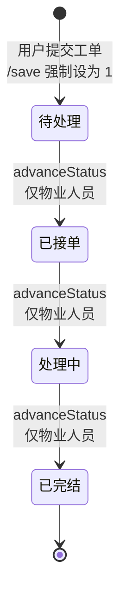

# 报修工单角色权限矩阵

> 本文档从代码反推，描述报修模块（`baoxiu`）各角色的可见范围与操作权限。
> **已知缺口**以 `[GAP]` 标注，不要误当已实现功能。

---

## 1. 角色定义

系统中与报修模块相关的角色共三种，登录后由 `TokenEntity.role` 写入 Session：

| 角色名 | 对应用户表 | 登录入口 | 代码中的角色字符串 |
|--------|-----------|----------|-------------------|
| 管理员 | `users` | 后台管理面板 | `"管理员"` |
| 物业人员（安保人员） | `wuye` | 后台管理面板 | `"物业人员"` |
| 用户（业主/住户） | `yonghu` | 前端门户 | `"用户"` |

> **注意**：前端菜单配置 `menu.js` 中将物业角色标记为 `"安保人员"`，但后端 `BaoxiuServiceImpl` 中角色判断使用的是 `"物业人员"`。两者必须在登录时映射为相同字符串，否则状态推进权限会失效。

---

## 2. 报修工单状态

状态常量定义于 `BaoxiuService.java:32-35`：

| 状态码 | 含义 | 说明 |
|--------|------|------|
| **1** | 待处理 | 工单初始状态 |
| **2** | 已接单 | 物业人员已受理 |
| **3** | 处理中 | 正在维修 |
| **4** | 已完结 | 维修完成（终态） |

---

## 3. 状态迁移规则

状态迁移表定义于 `BaoxiuServiceImpl.java:47-52`，严格线性，不可跳步，不可回退：

```
待处理(1) ──► 已接单(2) ──► 处理中(3) ──► 已完结(4)
              仅物业人员      仅物业人员      仅物业人员
```



**执行入口**：`BaoxiuController.advanceStatus()` (`:208-219`) → `BaoxiuServiceImpl.advanceStatus()` (`:66-98`)

校验逻辑（`:83-93`）：
1. 查 `VALID_TRANSITIONS` 确认当前状态→目标状态是合法迁移
2. 查 `ALLOWED_ROLES` 确认当前操作角色有权执行此步推进
3. 任一不满足则抛出 `EIException`

---

## 4. 权限矩阵：功能维度

### 4.1 后端接口实际保护情况

| 操作 | 接口 | 管理员 | 物业人员 | 用户 | 服务端角色检查 | 服务端归属检查 |
|------|------|--------|----------|------|---------------|---------------|
| **列表查看** | `/page` | 全部工单 | 全部工单 ¹ | 仅自己的 | 有（数据过滤） | 用户按 yonghuId |
| **详情查看** | `/info/{id}` | 任意 | 任意 | 任意 | **无 [GAP-1]** | **无 [GAP-1]** |
| **创建工单** | `/save` | 可 | 可 | 可 ² | 部分 | 用户强制绑 userId |
| **修改工单** | `/update` | 可 | 可 | 可 | **无 [GAP-2]** | **无 [GAP-2]** |
| **删除工单** | `/delete` | 可 | 可 | 可 | **无 [GAP-3]** | **无 [GAP-3]** |
| **推进状态** | `/advanceStatus` | 拒绝 | 可 | 拒绝 | **有** | 无 |
| **前端列表** | `/list` | 任意 | 任意 | 任意 | **无（@IgnoreAuth）[GAP-4]** | **无** |
| **前端创建** | `/add` | 可 | 可 | 可 | **无 [GAP-5]** | **无 [GAP-5]** |

> ¹ 物业人员的 `/page` 虽设置了 `wuyeId` 过滤参数，但 MyBatis mapper (`BaoxiuDao.xml`) 中无对应 `<if>` 条件，参数被静默忽略，实际返回全部工单。
> ² 用户角色创建时，`yonghuId` 从 Session 强制注入；但非用户角色可提交任意 `yonghuId`。

### 4.2 前端菜单权限（仅影响 UI 按钮显隐，不构成安全屏障）

| 操作按钮 | 管理员 | 物业人员(安保人员) | 用户(前端) |
|----------|--------|-------------------|------------|
| 查看 | 显示 | 显示 | 显示 |
| 新增 | 显示 | 显示 | 显示 |
| 修改 | 显示 | 显示 | 隐藏（注释掉） |
| 删除 | 显示 | 隐藏（menu.js 未配） | 显示 |
| 状态推进 | — | — | — |

> 前端权限由 `isAuth()` 纯客户端函数控制（`admin/src/utils/utils.js`），硬编码在 `menu.js` 中，**可被绕过**。

---

## 5. 数据可见范围

| 角色 | `/page`（后端列表） | `/list`（前端列表） |
|------|--------------------|--------------------|
| 管理员 | 全部 | 全部（无鉴权） |
| 物业人员 | 全部（`wuyeId` 过滤无效） | 全部（无鉴权） |
| 用户 | 仅 `yonghu_id = 当前用户` | 全部（无鉴权，需客户端自行传 yonghuId） |
| 未登录 | 拒绝 | **全部 [GAP-4]** |

---

## 6. 已知缺口 [GAP]

### GAP-1：`/info/{id}` 无归属检查

**位置**：`BaoxiuController.info()` (`:110-132`)

任何已登录用户只要知道工单 ID，即可查看任意工单详情（包含用户姓名、手机号、身份证号等敏感信息）。

### GAP-2：`/update` 无角色和归属检查

**位置**：`BaoxiuController.update()` (`:171-187`)

该接口直接调用 `updateById()`，可修改任意字段（包括 `baoxiuZhuangtaiTypes`），**完全绕过** `advanceStatus` 的状态迁移校验和角色校验。

```java
// 原始角色检查代码已被注释掉（:177-180）：
//  if(false)
//      return R.error(511,"永远不会进入");
//  else if("用户".equals(role))
//      baoxiu.setYonghuId(...);
```

**后果**：任何已登录用户可以通过 `/update` 将任意工单状态直接设为任意整数值，包括从"已完结"改回"待处理"。

### GAP-3：`/delete` 无角色和归属检查

**位置**：`BaoxiuController.delete()` (`:194-201`)

任何已登录用户可删除任意工单。且此处为**物理删除**（`deleteBatchIds`），数据不可恢复。

前端 `menu.js` 对物业人员角色隐藏了删除按钮，但后端无任何保护。

### GAP-4：`/list` 免鉴权暴露全量数据

**位置**：`BaoxiuController.list()` (`:284-298`)

标注 `@IgnoreAuth`，无需 Token 即可调用。返回数据包含 JOIN 后的用户表信息（姓名、手机、身份证、余额等），未做脱敏。

### GAP-5：前端 `/add` 不强制初始状态

**位置**：`BaoxiuController.add()` (`:332-353`)

与后端 `/save` 不同，`/add` **不会**将 `baoxiuZhuangtaiTypes` 强制设为 `STATUS_PENDING(1)`，而是直接使用客户端传入的值。

前端 `add.html` 实际硬编码为 `baoxiuZhuangtaiTypes=2`（已接单），导致前端提交的工单跳过"待处理"阶段。

### GAP-6：`wuyeId` 数据过滤无效

**位置**：`BaoxiuController.page()` (`:93-94`) 与 `BaoxiuDao.xml`

控制器为物业人员角色注入 `params.put("wuyeId", ...)` 试图做数据隔离，但：
- `baoxiu` 表本身**没有** `wuye_id` 列
- MyBatis mapper 中**没有**对应的 `<if test="params.wuyeId">` 条件

该过滤参数被静默忽略，物业人员实际看到全部工单。

### GAP-7：前端权限为纯客户端控制

所有 UI 按钮的显隐依赖 `isAuth()` 函数，该函数读取 `localStorage.role` 并匹配 `menu.js` 硬编码的权限表。攻击者可直接调用后端接口或修改 `localStorage` 绕过。

**后端没有任何 `@RequiresPermissions`、`@RequiresRoles`、`@PreAuthorize` 等服务端权限注解。**

---

## 7. 操作矩阵速查（期望 vs 实际）

| 操作 | 期望行为 | 实际行为 | 差异 |
|------|---------|---------|------|
| 用户创建工单 | 状态=待处理，绑定自己 | `/save` 正确；`/add` 状态由客户端决定 | `/add` 缺陷 |
| 物业推进状态 | 仅物业可按 1→2→3→4 推进 | `/advanceStatus` 正确 | 无 |
| 用户修改工单 | 仅能改自己的，不能改状态 | `/update` 可改任意工单任意字段 | 严重缺陷 |
| 用户删除工单 | 仅能删自己的 | `/delete` 可删任意工单 | 严重缺陷 |
| 物业删除工单 | 不允许 | `/delete` 可删任意工单 | 严重缺陷 |
| 查看他人工单详情 | 不允许 | `/info/{id}` 可查任意 | 缺陷 |
