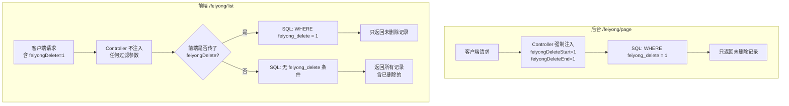

# 物业费 feiyongDelete 软删与列表过滤说明

> 适用范围：物业培训 / 二线技术支持 / 业主方运维手册
> 基于代码版本：`FeiyongController.java`、`FeiyongServiceImpl.java`、`FeiyongDao.xml`

---

## 1. 什么是"软删除"

本系统的物业费记录**不会被物理删除**。点击"删除"按钮时，实际上是将记录的 `feiyong_delete` 字段从 `1` 改为 `2`，数据仍保留在数据库中。

### `feiyong_delete` 字段定义

| 字段名 | 数据库列 | 类型 | 说明 |
|--------|----------|------|------|
| `feiyongDelete` | `feiyong_delete` | `int(11)` | 逻辑删除标记 |

| 值 | 含义 | 说明 |
|----|------|------|
| `1` | 正常（未删除） | 新增记录时的默认值 |
| `2` | 已删除（软删） | 执行"删除"操作后的值 |

---

## 2. 删除操作的完整流程

### 接口：`POST /feiyong/delete`

```
请求体：{"ids": [1, 2, 3]}
```

**实际执行的 SQL 效果：**

```sql
-- 不是 DELETE FROM，而是 UPDATE
UPDATE feiyong SET feiyong_delete = 2 WHERE id IN (1, 2, 3);
```

**代码实现**（`FeiyongController.delete()`，第 193-209 行）：

```java
// 对每个 id，构造一个只包含 id 和 feiyongDelete=2 的实体
for(Integer id : ids){
    FeiyongEntity feiyongEntity = new FeiyongEntity();
    feiyongEntity.setId(id);
    feiyongEntity.setFeiyongDelete(2);   // 标记为已删除
    list.add(feiyongEntity);
}
// 批量更新（不是批量删除）
feiyongService.updateBatchById(list);
```

**关键点：**
- 数据库中**始终保留**这条记录
- 只是将标记位从 `1` 改为 `2`
- 理论上手写 SQL 可以查到所有"已删除"的记录
- **无法通过系统界面恢复**已删除的记录（没有"撤销删除"功能）

---

## 3. 列表查询如何过滤已删除记录

系统有**两个列表接口**，过滤机制不同：

### 3.1 后台列表 `GET /feiyong/page`（管理员/物业人员/用户后台）

**服务端强制过滤，不可绕过。**

```java
// FeiyongController.page() 第 95 行
params.put("feiyongDeleteStart", 1);
params.put("feiyongDeleteEnd", 1);
```

这两行代码在服务端硬编码注入查询参数，最终生成的 SQL 条件为：

```sql
AND a.feiyong_delete >= 1 AND a.feiyong_delete <= 1
-- 等价于：
AND a.feiyong_delete = 1
```

**效果：** 无论前端传什么参数，后台列表**只显示未删除的记录**（`feiyong_delete = 1`）。客户端无法通过参数篡改来查看已删除记录。

### 3.2 前端列表 `GET /feiyong/list`（业主前端页面）

**依赖前端传参过滤，服务端不强制。**

该接口标注了 `@IgnoreAuth`（无需登录），服务端**不注入**任何 `feiyongDelete` 过滤条件。过滤完全依赖前端页面在请求中传入 `feiyongDelete=1`：

```javascript
// front/pages/feiyong/list.html 前端代码
searchForm: {
    page: 1,
    limit: 8,
    feiyongDelete: 1,          // 前端传入，过滤未删除的记录
    yonghuId: localStorage.getItem('userid'),
}
```

对应的 SQL 条件（`FeiyongDao.xml`）：

```xml
<if test="params.feiyongDelete != null and params.feiyongDelete != ''">
    and a.feiyong_delete = #{params.feiyongDelete}
</if>
```

**效果：** 正常情况下前端传入 `feiyongDelete=1`，只显示未删除记录。但如果构造请求时**不传**这个参数，服务端不会强制过滤，已删除的记录也会被返回。

---

## 4. 过滤机制对比图



---

## 5. 其他接口的软删行为

| 接口 | 方法 | 是否过滤已删除记录 | 说明 |
|------|------|:-------------------:|------|
| `GET /feiyong/page` | 后台列表 | **是（服务端强制）** | 硬编码 `feiyongDeleteStart=1, feiyongDeleteEnd=1` |
| `GET /feiyong/list` | 前端列表 | **依赖前端传参** | 服务端不强制 |
| `GET /feiyong/info/{id}` | 后台详情 | **否** | `selectById()` 不过滤 `feiyong_delete`，可直接查到已删除记录 |
| `GET /feiyong/detail/{id}` | 前端详情 | **否** | 同上 |
| `POST /feiyong/update` | 修改 | **否** | 已删除的记录仍然可以被修改 |
| `POST /feiyong/save` | 后台新增 | — | 新增时强制 `feiyongDelete = 1` |
| `POST /feiyong/add` | 前端新增 | — | 新增时强制 `feiyongDelete = 1` |
| `POST /feiyong/delete` | 删除 | — | 软删除，设 `feiyongDelete = 2` |

---

## 6. 新增记录时的去重逻辑与软删的关系

新增时（`/save` 和 `/add`），去重检查的 `EntityWrapper` 包含 `feiyong_delete` 条件：

```java
.eq("yonghu_id", feiyong.getYonghuId())
.eq("feiyong_name", feiyong.getFeiyongName())
.eq("feiyong_types", feiyong.getFeiyongTypes())
.eq("feiyong_zhuangtai_types", feiyong.getFeiyongZhuangtaiTypes())
.eq("feiyong_time", feiyong.getFeiyongTime())
.eq("feiyong_delete", feiyong.getFeiyongDelete())   // 参与去重判断
```

**这意味着：** 如果一条物业费记录被软删（`feiyong_delete = 2`），再新建一条完全相同的记录（`feiyong_delete = 1`），**不会被判定为重复**，因为 `feiyong_delete` 值不同。

**对物业的说明：** 删除了一条物业费记录后，可以重新创建一条内容完全相同的记录，系统不会报"表中有相同数据"的错误。

---

## 7. 为什么没有用 MyBatis-Plus 的 `@TableLogic`

当前代码中 `feiyongDelete` 字段**没有**标注 `@TableLogic` 注解。

这意味着 MyBatis-Plus 的内置方法（`selectById`、`selectList`、`selectOne`、`selectBatchIds`、`updateById`、`deleteById` 等）**不会自动**过滤或处理软删字段。所有软删逻辑都是手动实现的：

| 操作 | 实现方式 |
|------|----------|
| 软删除 | 手动 `setFeiyongDelete(2)` + `updateBatchById()` |
| 列表过滤 | 手动在 SQL 的 `<where>` 中拼接 `feiyong_delete` 条件 |
| 详情查看 | **无过滤**（直接 `selectById`） |

---

## 8. 已知缺口（代码中未实现的功能）

> 以下内容是当前代码中**存在但行为不完善**的地方，**不是已实现功能**，需要后续版本修复。

### 缺口 1：`/feiyong/list` 前端列表缺少服务端强制过滤

| 项目 | 说明 |
|------|------|
| **位置** | `FeiyongController.list()`（第 275-289 行） |
| **现象** | 服务端不注入 `feiyongDelete` 过滤条件，完全依赖前端传参 |
| **后果** | 技术上可以构造不带 `feiyongDelete` 参数的请求，查看所有已删除的物业费记录 |
| **风险等级** | 中。需要一定的技术能力才能绕过前端 |
| **建议** | 参照 `/page` 接口，在服务端也强制注入 `feiyongDeleteStart=1, feiyongDeleteEnd=1` |

### 缺口 2：详情接口不过滤已删除记录

| 项目 | 说明 |
|------|------|
| **位置** | `FeiyongController.info()` 和 `detail()` |
| **现象** | 使用 `selectById()` 查询，不检查 `feiyong_delete` 值 |
| **后果** | 已知记录 ID 的情况下，可以直接查看已删除的物业费记录详情 |

### 缺口 3：`/update` 接口可以修改已删除的记录

| 项目 | 说明 |
|------|------|
| **位置** | `FeiyongController.update()`（第 173-186 行） |
| **现象** | `updateById()` 不检查 `feiyong_delete` 值。且角色校验代码被注释掉 |
| **后果** | 已软删的记录仍可被修改内容和金额 |

### 缺口 4：`CommonUtil.checkMap()` 可能意外移除过滤条件

| 项目 | 说明 |
|------|------|
| **位置** | `com.utils.CommonUtil.checkMap()` |
| **现象** | 该方法会移除值为 `null`、空字符串 `""`、或字符串 `"null"` 的参数 |
| **后果** | 如果前端传入 `feiyongDelete=`（空字符串），该参数会被移除，导致软删过滤失效 |
| **触发场景** | 前端表单中存在 `feiyongDelete` 字段但值为空 |

---

## 9. 常见问题 FAQ

### Q1：物业费列表里删除了一条记录，数据库里还有吗？

**有。** 删除只是把 `feiyong_delete` 从 `1` 改为 `2`，记录本身不删除。如果需要恢复，可以在数据库中手动将 `feiyong_delete` 改回 `1`（系统界面无此功能）。

### Q2：为什么删除后列表里还能看到？

正常情况**不应该**看到。如果出现这种情况，请检查：
- 是通过后台（`/page`）还是前端（`/list`）查看的？后台一定有过滤，前端依赖传参
- 是否有直接查询数据库的工具在查看（直接查 SQL 不过滤）

### Q3：删除一条物业费后，能重新创建一条一模一样的吗？

**可以。** 去重判断包含 `feiyong_delete` 字段，软删的记录（值为 `2`）和新建的记录（值为 `1`）被视为不同数据，不会触发"表中有相同数据"的报错。

### Q4：有没有"彻底删除"的功能？

**没有。** 系统中不存在物理删除物业费记录的接口。如果需要彻底清除，只能在数据库层面操作。

---

## 10. 代码引用索引

| 文件 | 路径 |
|------|------|
| Controller | `src/main/java/com/controller/FeiyongController.java` |
| Service 实现 | `src/main/java/com/service/impl/FeiyongServiceImpl.java` |
| Entity | `src/main/java/com/entity/FeiyongEntity.java` |
| Mapper XML | `src/main/resources/mapper/FeiyongDao.xml` |
| 前端列表页 | `src/main/resources/front/front/pages/feiyong/list.html` |
| 后台列表页 | `src/main/resources/admin/admin/src/views/modules/feiyong/list.vue` |
