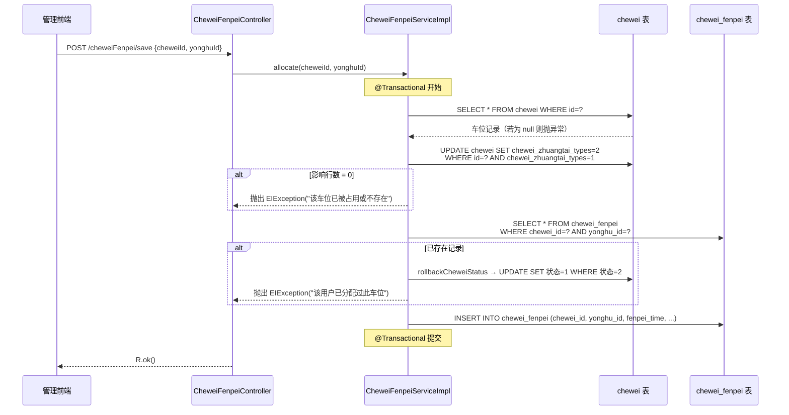
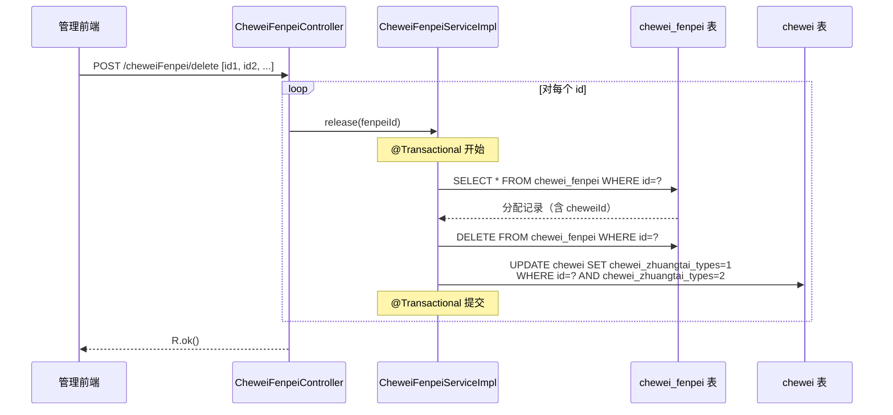

# 车位分配与 Chewei 状态联动规范

> 本文档从代码反推，描述车位分配（`chewei_fenpei`）与车位状态（`chewei.chewei_zhuangtai_types`）之间的联动逻辑。
> **已知缺口**已在文中以 `[GAP]` 标注，不要误当已实现功能。

---

## 1. 涉及数据表

| 表名 | 用途 | 关键字段 |
|------|------|----------|
| `chewei` | 车位主表 | `id`, `chewei_name`(位置), `chewei_types`(车位类型), **`chewei_zhuangtai_types`**(车位状态), `chewei_xiangqing`(详情) |
| `chewei_fenpei` | 分配记录表 | `id`, `chewei_id`(FK→chewei), `yonghu_id`(FK→yonghu), `fenpei_time`(分配时间) |

两张表之间通过 `chewei_fenpei.chewei_id → chewei.id` 关联。

---

## 2. 车位状态值定义

状态码定义于 `CheweiFenpeiServiceImpl.java:45-46`，字典表 `dictionary`（dicCode = `chewei_zhuangtai_types`）存储人类可读标签。

| 状态码 | 含义 | 说明 |
|--------|------|------|
| **1** | 空闲 | 可被分配 |
| **2** | 已占用 | 已分配给某住户 |

> 仅有上述两个值，无"维修中""预留"等中间态。

---

## 3. 状态机

```
  ┌───────────────────────────────┐
  │                               │
  │    ┌───────┐  allocate()  ┌───────────┐
  │    │ 空闲  │ ──────────► │  已占用   │
  │    │  (1)  │              │   (2)     │
  │    └───────┘ ◄────────── └───────────┘
  │                release()              │
  │                               │
  └───────────────────────────────┘
```

- **空闲 → 已占用**：通过 `CheweiFenpeiService.allocate()` 触发
- **已占用 → 空闲**：通过 `CheweiFenpeiService.release()` 触发
- 两个方向均使用 CAS（Compare-And-Swap）条件更新，防止并发脏写

---

## 4. 分配流程（allocate）

### 4.1 入口

| 层级 | 位置 | 说明 |
|------|------|------|
| Controller | `CheweiFenpeiController.save()` (`:146`) | 后端管理面板调用 |
| Service | `CheweiFenpeiServiceImpl.allocate()` (`:57-98`) | 核心业务逻辑 |

### 4.2 步骤

1. **参数校验**（`:58-60`）— `cheweiId` 和 `yonghuId` 不能为空
2. **查询车位**（`:63-66`）— 确认车位记录存在
3. **CAS 占位**（`:69-78`）— `UPDATE chewei SET chewei_zhuangtai_types=2 WHERE id=? AND chewei_zhuangtai_types=1`，影响行数为 0 则抛出"已被占用"
4. **重复检查**（`:81-89`）— 查询 `chewei_fenpei` 中是否已存在同 `chewei_id + yonghu_id` 的记录；若存在，先调 `rollbackCheweiStatus()` 回滚车位状态，再抛异常
5. **插入分配记录**（`:92-97`）— 写入 `chewei_fenpei` 表

### 4.3 Mermaid 时序图



---

## 5. 释放流程（release / delete）

### 5.1 入口

| 层级 | 位置 | 说明 |
|------|------|------|
| Controller | `CheweiFenpeiController.delete()` (`:187`) | 遍历 ids 逐条调用 release |
| Service | `CheweiFenpeiServiceImpl.release()` (`:101-119`) | 核心业务逻辑 |

### 5.2 步骤

1. **参数校验**（`:103-105`）— `fenpeiId` 不能为空
2. **查询分配记录**（`:107-109`）— 确认分配记录存在
3. **获取 cheweiId**（`:112`）— 从分配记录中取出关联的车位 ID
4. **删除分配记录**（`:115`）— `DELETE FROM chewei_fenpei WHERE id=?`
5. **回滚车位状态**（`:118`）— 调用 `rollbackCheweiStatus(cheweiId)`

### 5.3 rollbackCheweiStatus 实现（`:124-132`）

```java
UPDATE chewei SET chewei_zhuangtai_types = 1 (空闲)
WHERE id = ? AND chewei_zhuangtai_types = 2 (已占用)
```

同样使用 CAS，仅当车位当前为"已占用"才回滚为"空闲"。

### 5.4 Mermaid 时序图



---

## 6. 双写（Dual-Write）模式总结

分配和释放都涉及对 **两张表** 的写操作，在同一个 `@Transactional` 事务内完成：

| 操作 | 写入 1（chewei 表） | 写入 2（chewei_fenpei 表） |
|------|---------------------|---------------------------|
| **分配 allocate** | `SET 状态=2 WHERE 状态=1`（CAS 占位） | `INSERT` 分配记录 |
| **释放 release** | `SET 状态=1 WHERE 状态=2`（CAS 回滚） | `DELETE` 分配记录 |

事务保证原子性：任一写入失败则整体回滚。

---

## 7. 并发控制

`allocate()` 和 `rollbackCheweiStatus()` 均采用**乐观锁 / CAS** 策略：

- 不使用 `SELECT ... FOR UPDATE` 悲观锁
- 通过 `WHERE chewei_zhuangtai_types = 预期值` 条件判断是否有并发冲突
- 若 `UPDATE` 影响行数为 0，说明被其他线程抢先修改，操作终止

---

## 8. 已知缺口 [GAP]

### GAP-1：前端 `/add` 接口绕过双写

**位置**：`CheweiFenpeiController.add()` (`:312-330`)

前端保存接口 `/cheweiFenpei/add` **仅插入 `chewei_fenpei` 记录**，不调用 `allocate()` 方法，**不更新 `chewei.chewei_zhuangtai_types`**。

```java
// add() 内部直接调用：
cheweiFenpeiService.insert(cheweiFenpei);  // 仅写 chewei_fenpei，不动 chewei 表
```

**后果**：通过此入口创建的分配记录不会将车位标记为"已占用"。车位状态仍为"空闲"，可被重复分配。

**对比**：后端 `/save` 接口正确调用了 `cheweiFenpeiService.allocate()`，会执行双写。

### GAP-2：删除车位不检查分配记录

**位置**：`CheweiController.delete()` (`:179`)

删除车位主记录时**没有检查** `chewei_fenpei` 表中是否存在引用此车位的分配记录。

**后果**：可能产生孤儿分配记录 — `chewei_fenpei.chewei_id` 指向已被删除的 `chewei.id`。

### GAP-3：`/update` 接口可绕过状态约束

**位置**：`CheweiFenpeiController.update()` (`:166-179`)

该接口直接调用 `updateById()`，可以修改 `chewei_id` 等关键字段，但**不联动更新车位状态**。

**后果**：若通过 `/update` 将分配记录的 `chewei_id` 从 A 改为 B，则车位 A 仍显示"已占用"，车位 B 不会被标记为"已占用"。

### GAP-4：批量导入绕过双写

**位置**：`CheweiFenpeiController.batchInsert()` (`:203-250`)

批量导入使用 `insertBatch()`，不调用 `allocate()`。虽然导入代码目前被注释掉（字段赋值行全部注释），但如果将来启用，同样不会更新车位状态。

---

## 9. 接口清单

| 接口路径 | HTTP | 入口方法 | 是否联动车位状态 | 需要登录 |
|----------|------|----------|------------------|----------|
| `/cheweiFenpei/page` | GET | `page()` | — 查询 | 是 |
| `/cheweiFenpei/info/{id}` | GET | `info()` | — 查询 | 是 |
| `/cheweiFenpei/save` | POST | `save()` → `allocate()` | **是（双写）** | 是 |
| `/cheweiFenpei/update` | POST | `update()` | **否 [GAP-3]** | 是 |
| `/cheweiFenpei/delete` | POST | `delete()` → `release()` | **是（双写）** | 是 |
| `/cheweiFenpei/list` | GET | `list()` | — 查询 | 否 (`@IgnoreAuth`) |
| `/cheweiFenpei/detail/{id}` | GET | `detail()` | — 查询 | 是 |
| `/cheweiFenpei/add` | POST | `add()` | **否 [GAP-1]** | 是 |
| `/cheweiFenpei/batchInsert` | POST | `batchInsert()` | **否 [GAP-4]** | 是 |
