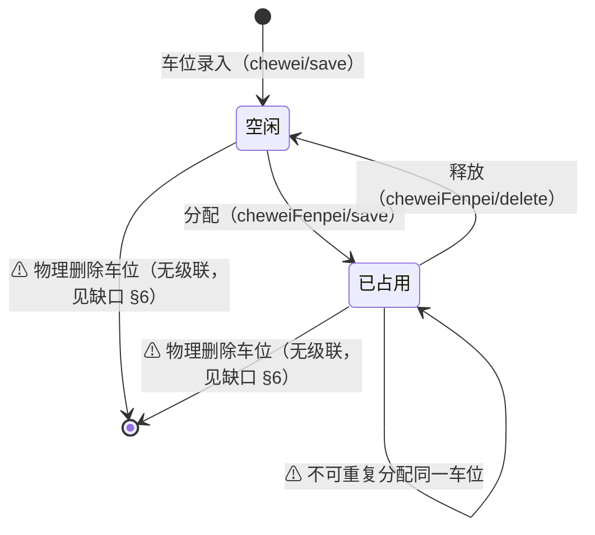
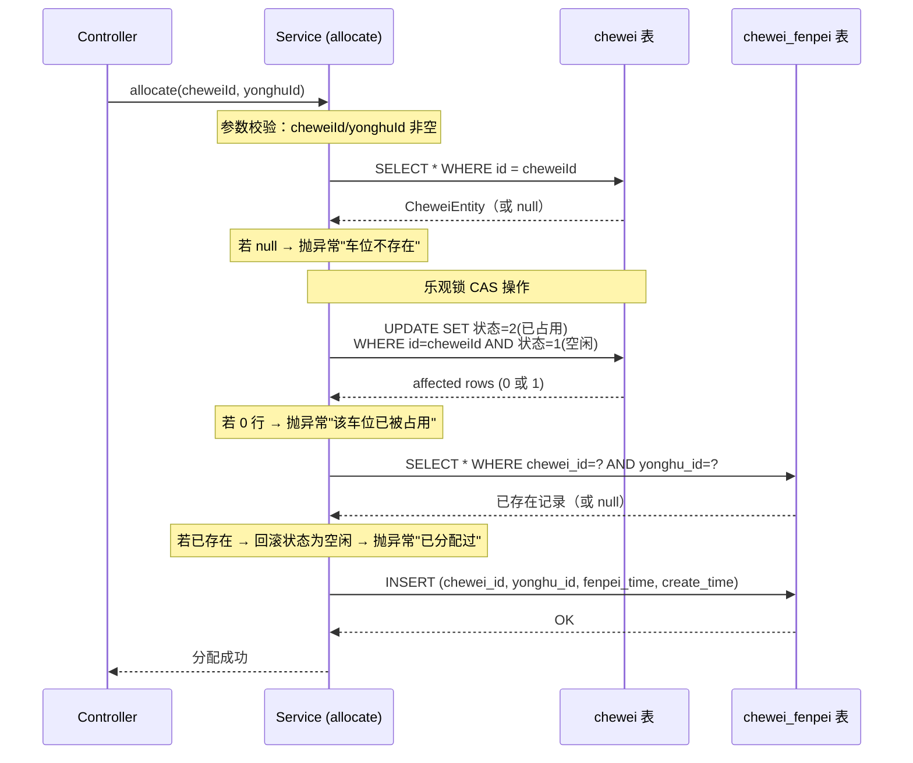
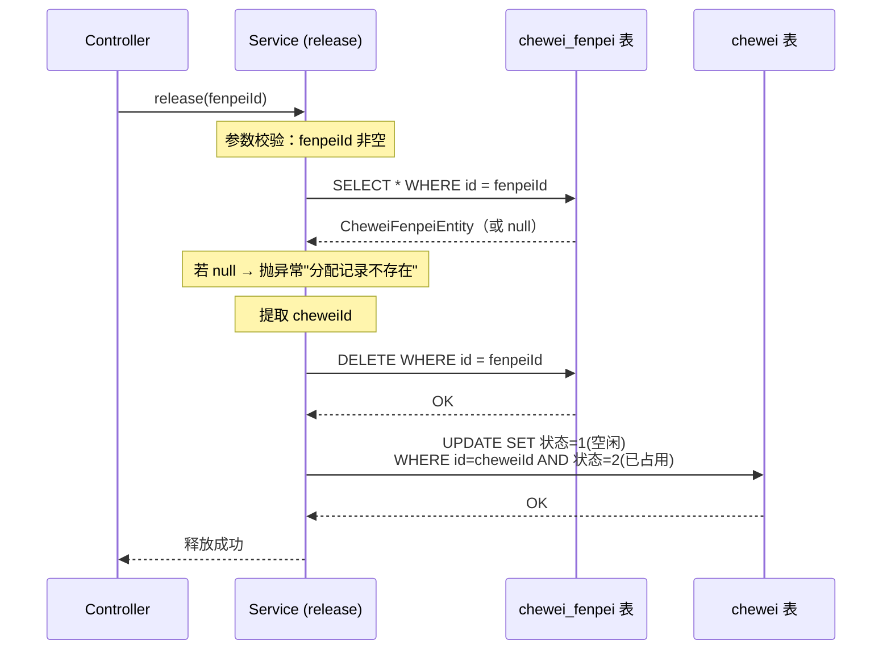

# 车位分配与 Chewei 状态联动规范

> 适用范围：物业培训 / 二线技术支持 / 业主方运维手册
> 基于代码版本：`CheweiFenpeiServiceImpl.java`、`CheweiFenpeiController.java`、`CheweiController.java`

---

## 1. 涉及的两张表

| 表名 | 用途 | 关键字段 |
|------|------|----------|
| `chewei` | 车位基础信息 | `id`, `chewei_name`, `chewei_zhuangtai_types`（状态） |
| `chewei_fenpei` | 车位分配记录 | `id`, `chewei_id`（FK→chewei）, `yonghu_id`（FK→yonghu）, `fenpei_time` |

### 车位状态码（`chewei_zhuangtai_types`）

| 值 | 含义 | 常量名 |
|----|------|--------|
| `1` | 空闲 | `CHEWEI_STATUS_FREE` |
| `2` | 已占用 | `CHEWEI_STATUS_OCCUPIED` |

状态值存储在 `dictionary` 表中（`dic_code = 'chewei_zhuangtai_types'`），由 `DictionaryServiceImpl.dictionaryConvert()` 在列表返回时翻译为中文显示值。

---

## 2. 状态机（State Machine）

**状态流转规则：**

- **只有一条正向路径**：空闲 → 已占用（通过 `allocate()`）
- **只有一条反向路径**：已占用 → 空闲（通过 `release()`）
- 不存在"维修中"等中间状态
- 不存在跳过分配直接将状态改为"已占用"的正规途径

---

## 3. 核心操作时序

### 3.1 分配车位（`POST /cheweiFenpei/save`）

调用链：`CheweiFenpeiController.save()` → `CheweiFenpeiServiceImpl.allocate(cheweiId, yonghuId)`

**双写说明：** `allocate()` 在一个 `@Transactional` 中同时写入两张表：
1. `chewei` 表：`UPDATE chewei_zhuangtai_types = 2 WHERE id = ? AND chewei_zhuangtai_types = 1`
2. `chewei_fenpei` 表：`INSERT INTO chewei_fenpei (...)`

如果任何一步失败（异常），整个事务回滚，保证两张表的数据一致性。

**乐观锁（CAS）防并发：** UPDATE 语句带 `WHERE chewei_zhuangtai_types = 1` 条件，确保只有"空闲"状态的车位能被分配。如果两个请求同时分配同一车位，只有一个能成功（affected rows = 1），另一个失败（affected rows = 0）。

### 3.2 释放车位（`POST /cheweiFenpei/delete`）

调用链：`CheweiFenpeiController.delete()` → 对每个 ID 调用 `CheweiFenpeiServiceImpl.release(id)`

**双写说明：** `release()` 同样在一个 `@Transactional` 中同时写入两张表：
1. `chewei_fenpei` 表：`DELETE FROM chewei_fenpei WHERE id = ?`（物理删除分配记录）
2. `chewei` 表：`UPDATE chewei_zhuangtai_types = 1 WHERE id = ? AND chewei_zhuangtai_types = 2`

---

## 4. 各接口对状态的影响汇总

| 接口 | 方法 | 是否写 `chewei` 表 | 是否写 `chewei_fenpei` 表 | 事务保护 |
|------|------|---------------------|---------------------------|----------|
| `/cheweiFenpei/save` | `allocate()` | 状态 → 已占用 | INSERT | `@Transactional(rollbackFor)` |
| `/cheweiFenpei/delete` | `release()` | 状态 → 空闲 | DELETE（物理删除） | `@Transactional(rollbackFor)` |
| `/cheweiFenpei/update` | `updateById()` | **不写** | UPDATE（不改状态） | 无（单表操作） |
| `/cheweiFenpei/add`（前端） | 直接 `insert()` | **不写** | INSERT | 无 |
| `/chewei/save` | 直接 `insert()` | INSERT 新车位 | 不写 | 无 |
| `/chewei/delete` | `deleteBatchIds()` | DELETE（物理删除） | **不级联删除** | 无 |
| `/chewei/update` | `updateById()` | UPDATE | 不写 | 无 |

---

## 5. 常见问题 FAQ

### Q1：删了分配记录，车位为什么还显示"已占用"？

**如果通过 `/cheweiFenpei/delete` 删除**：状态**会**自动回滚为"空闲"。这是 `release()` 方法的核心逻辑，且在同一事务内完成。如果仍然显示"已占用"，请排查：
- 是否通过其他途径（如 `/cheweiFenpei/update` 或前端 `/cheweiFenpei/add`）操作过，这些接口**不会**联动状态
- 是否有直接操作数据库绕过了 Service 层

### Q2：一个车位能分给多个人吗？

**不能。** `allocate()` 使用乐观锁（CAS），只有状态为"空闲"的车位才能分配。一旦分配成功，状态变为"已占用"，后续对同一车位的分配请求会因 CAS 失败而被拒绝。

### Q3：一个用户能分配多个车位吗？

**代码层面没有限制。** `allocate()` 的去重检查是 `chewei_id + yonghu_id` 组合，只阻止同一用户重复分配同一车位，不阻止同一用户分配不同车位。

### Q4：删除车位后，对应的分配记录还在吗？

**在。** `/chewei/delete` 调用的是 `deleteBatchIds()`，只删除 `chewei` 表记录，**不级联删除** `chewei_fenpei` 表的分配记录。这会导致孤立的分配记录存在。详见下方 §6 已知缺口。

---

## 6. 已知缺口（代码中未实现的功能）

> 以下内容是当前代码中**存在但行为不符合预期**的地方，**不是已实现功能**，需要后续版本修复。

### 缺口 1：`/cheweiFenpei/add`（前端保存）绕过了状态联动

| 项目 | 说明 |
|------|------|
| **位置** | `CheweiFenpeiController.add()`（第 312-330 行） |
| **现象** | 该接口直接调用 `cheweiFenpeiService.insert()`，**不经过 `allocate()` 方法** |
| **后果** | `chewei_fenpei` 表新增了分配记录，但 `chewei` 表的状态**不会**更新为"已占用"。车位在列表中仍显示"空闲" |
| **影响范围** | 仅前端 `/add` 接口；后台 `/save` 接口走的是 `allocate()` 不受影响 |
| **建议** | 前端保存也应统一调用 `allocate()` 方法，或在 `add()` 中增加相同的双写逻辑 |

### 缺口 2：`/chewei/delete`（删除车位）不级联清理分配记录

| 项目 | 说明 |
|------|------|
| **位置** | `CheweiController.delete()`（第 179-185 行） |
| **现象** | 调用 `deleteBatchIds()` 物理删除 `chewei` 表记录，不检查也不删除 `chewei_fenpei` 中的关联记录 |
| **后果** | 产生孤立的 `chewei_fenpei` 记录，`chewei_id` 指向已不存在的车位 |
| **建议** | 删除车位前应先检查是否有分配记录，或自动级联释放后再删除 |

### 缺口 3：`/cheweiFenpei/update`（修改分配记录）不同步状态

| 项目 | 说明 |
|------|------|
| **位置** | `CheweiFenpeiController.update()`（第 166-179 行） |
| **现象** | 直接调用 `updateById()`，如果修改了 `cheweiId`（换了车位），旧车位不会回滚为"空闲"，新车位不会变为"已占用" |
| **后果** | 两张表的状态不一致 |
| **建议** | 如需换车位，应走"先释放旧车位、再分配新车位"的流程 |

### 缺口 4：`/cheweiFenpei/delete` 批量删除无原子性保证

| 项目 | 说明 |
|------|------|
| **位置** | `CheweiFenpeiController.delete()`（第 186-197 行） |
| **现象** | 对传入的 ID 数组逐个调用 `release()`，每个 `release()` 各自独立事务。若第 3 个失败，前 2 个已释放不会回滚 |
| **后果** | 批量操作部分成功、部分失败 |
| **建议** | 将循环提升到同一个 `@Transactional` 方法内 |

---

## 7. 代码引用索引

| 文件 | 路径 |
|------|------|
| Controller | `src/main/java/com/controller/CheweiFenpeiController.java` |
| Controller | `src/main/java/com/controller/CheweiController.java` |
| Service 实现 | `src/main/java/com/service/impl/CheweiFenpeiServiceImpl.java` |
| Entity | `src/main/java/com/entity/CheweiEntity.java` |
| Entity | `src/main/java/com/entity/CheweiFenpeiEntity.java` |
| Mapper XML | `src/main/resources/mapper/CheweiFenpeiDao.xml` |
| Mapper XML | `src/main/resources/mapper/CheweiDao.xml` |
